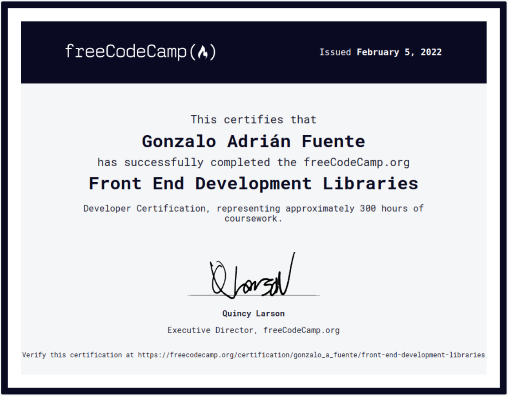
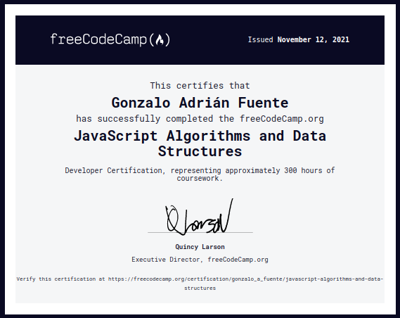
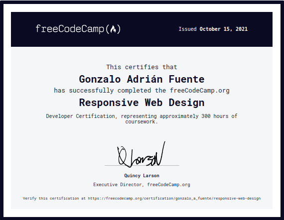

- 👋 Hi, I'm Gonzalo.
- 🌎 I'm coding from Argentina.
- 👨🏻‍🎓 I love learning new things, so I love coding, since I need to <strong>learn everyday</strong>...

- 🌱 I’m skilling up with:

  🧑🏻‍🏫 

  - Currently ➡️ Back End Development and APIs.
  
  - Finished ➡️ Front End Development Libraries. [Link to Certification!](https://www.freecodecamp.org/certification/gonzalo_a_fuente/front-end-development-libraries)
 
     
     
  - Finished ➡️ JavaScript Algorithms and Data Structures. [Link to Certification!](https://www.freecodecamp.org/certification/gonzalo_a_fuente/javascript-algorithms-and-data-structures)

     

  - Finished ➡️ Responsive Web Design. [Link to Certification!](https://www.freecodecamp.org/certification/gonzalo_a_fuente/responsive-web-design)

     

  🧑🏻‍🏫 

  - Currently ➡️ PCAP - Programming Essentials In Python.
